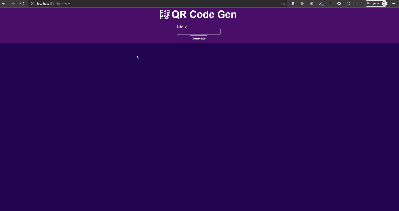

# <span style="color:magenta">NodeJS QRCode Gen App</span>


[](https://github.com/yilber/readme-boilerplate)
[](https://github.com/Yilber/readme-boilerplate/blob/master/LICENSE)


<!-- ## Background -->



> Super Simple JavaScript NodeJs QR Code generator!

### 📚 STACK
- Html
- Css
- Javascript
- Node Js (v17.2.0 - required)
- Express
- [QRCode](https://www.npmjs.com/package/qrcode)

## Installation

Open your terminal and type in

```sh
$ git clonehttps://github.com/sitowebveloce/nodejs-qrcode-gen-app.git
$ cd nodejs...
npm i
npm run dev
go to http://localhost:3311/
```

## How to use

* Clone the repo.
* Run
* Install packages. Enjoy.

## 🐛 Bugs

maybe...sure!

### Author

* [**Alex Paper**](https://www.sitowebveloce.it/) [](https://twitter.com/sitowebveloce)

### Support

Like what you see? Keep me awake at night by buying me a gradient.

<a href="https://buymeagradient.com/" target="_blank"></a>
<!-- <a href="https://www.patreon.com/bePatron?u=17267732" target="_blank"></a> -->
## License

2021 AlexPaper.

Usage is provided under the MIT License. See [LICENSE](https://github.com/Yilber/readme-boilerplate/blob/master/LICENSE) for the full details.
